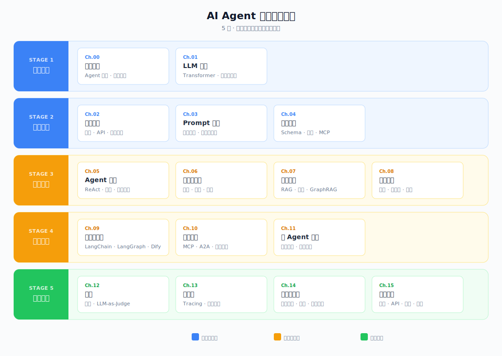



# LearnAgent

## AI Agent 系统化学习指南

一套从零开始学 AI Agent 的完整路径，覆盖底层原理 → 核心技能 → 架构设计 → 工程交付，层层递进。写给想系统理解 AI Agent 的开发者、产品经理和 AI 爱好者。

> [开始阅读 → 什么是 AI Agent](./docs/01-landscape/01-what-is-agent.md)

  

---

## 学习路径一览

| 阶段 | 章节 |
|------|------|
| 🎯 **基础认知** | [01 生态认知](./docs/01-landscape/README.md) · [02 LLM 基础](./docs/02-llm-basics/README.md) |
| 🛠 **核心技能** | [03 模型接入](./docs/03-model-access/README.md) · [04 Prompt 工程](./docs/04-prompt-engineering/README.md) · [05 工具调用](./docs/05-tool-use/README.md) · [06 Agent 循环](./docs/06-agent-loop/README.md) |
| 🏗 **架构设计** | [07 上下文工程](./docs/07-context-engineering/README.md) · [08 知识检索（RAG）](./docs/08-rag-pipeline/README.md) · [09 记忆管理](./docs/09-memory-management/README.md) · [10 框架与编排](./docs/10-framework/README.md) · [11 扩展协议](./docs/11-protocols/README.md) · [12 多 Agent 协作](./docs/12-multi-agent/README.md) |
| 🚀 **工程交付** | [13 评测](./docs/13-eval/README.md) · [14 可观测](./docs/14-observability/README.md) · [15 安全与治理](./docs/15-safety/README.md) · [16 产品交付](./docs/16-ship-to-prod/README.md) |

---

## 致谢

知识体系参考 [Anthropic Building Effective Agents](https://www.anthropic.com/engineering/building-effective-agents)、[OpenAI Prompt Engineering Guide](https://platform.openai.com/docs/guides/prompt-engineering)、[LangGraph Documentation](https://langchain-ai.github.io/langgraph/) 等权威资料，各篇文章末尾附有完整参考链接。

## License

[MIT](LICENSE)
