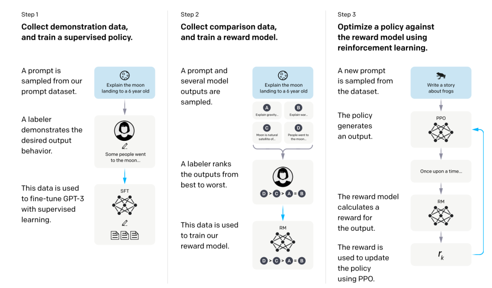
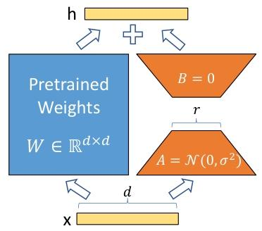

# 从 Base 到 Chat

> [LLM 发展简史](./03-llm-evolution.md)讲了从预训练范式到 ChatGPT 的历史脉络，这篇聚焦训练的**技术细节和实践影响**——预训练的数据怎么来、SFT 的数据长什么样、RLHF 和 DPO 到底有什么区别、LoRA 微调怎么做。理解这些，你才能判断什么时候该改 Prompt、什么时候该用 RAG、什么时候才值得微调。

## 目录

- [三阶段总览](#三阶段总览)
- [第一阶段：预训练](#第一阶段预训练)
- [第二阶段：指令微调（SFT）](#第二阶段指令微调sft)
- [第三阶段：人类对齐（RLHF 与 DPO）](#第三阶段人类对齐rlhf-与-dpo)
- [开发者实践指南](#开发者实践指南)
- [总结](#总结)
- [参考链接](#参考链接)

你好，我是江小湖。前面我们知道了预训练→SFT→对齐这条时间线是怎么走过来的。但这三个阶段内部到底在做什么？为什么 Base 模型不听指令？为什么微调注入知识不如 RAG？这篇拆开看细节。

## 三阶段总览

一个现代 LLM 的诞生经历三步，每一步的目标、数据和产出都不同：

```
互联网万亿Token → [预训练] → Base Model（有知识，不听指令）
     ↓
几万条人工指令对 → [SFT] → Instruct Model（听指令，可能不安全）
     ↓
人类偏好排序数据 → [RLHF/DPO] → Chat Model（安全、有用、诚实）
```

**类比**：预训练是上大学读遍所有课本（有知识但不会干活），SFT 是岗前培训学会听老板安排（会干活但可能违规），RLHF/DPO 是职业道德教育（知道什么该做什么不该做）。

## 变体如何从训练流程中产生

三阶段训练不是只产出"一个模型"——每一阶段都能独立产出一种可用变体，而后续阶段的训练是在前一个变体基础上继续加工。理解这一点，你才能明白为什么 HuggingFace 上同一个架构有 Base/Instruct/Chat 多个版本，以及它们分别适合什么场景。

### 训练变体：每一步产出一个独立 SKU

| 训练阶段 | 产出变体 | 训练目标 | 行为特征 | 能否直接用于 Agent |
|---------|---------|---------|---------|------------------|
| **预训练结束** | **Base Model** | 预测下一个词 | 会续写、会补全，但不会"回答问题" | ❌ 不能 |
| **+ SFT 后** | **Instruct Model** | 最大化指令-回答对的似然 | 能听懂指令格式，给出结构化回答 | ✅ 基础可用 |
| **+ 对齐后** | **Chat Model** | 满足人类偏好（有用/诚实/无害） | 拒绝危险请求、语气礼貌、价值观对齐 | ✅ **生产首选** |

**为什么 Base 模型不会听指令？** 预训练的目标是"预测下一个词"，模型在万亿 Token 中见过无数排比句、列表、问答对。当你说"请写一首关于春天的诗"，模型在参数中编码的概率分布最可能匹配的是它见过的类似文本模式——"请写一首关于夏天的诗、请写一首关于秋天的诗..."——所以它会**续写**而不是**回答**。这不是模型"没学会"，而是预训练目标函数（下一个词预测）的**必然产物**。

**SFT 改变了什么？** SFT 用人工编写的 `(指令, 回答)` 对重新训练模型，目标函数从"预测下一个词"变成"最大化指令-回答对的似然"。模型在优化过程中，参数编码了新的概率分布：看到指令格式的输入时，生成回答格式的输出。这就是 Instruct 模型能"听话"的原因——**目标函数变了，行为模式随之改变**。

**对齐又改变了什么？** SFT 只教了模型"怎么回答"，没教"什么不该回答"。RLHF/DPO 用人类偏好数据进一步训练，目标函数变成"让奖励模型（或偏好概率）给高分"。模型在优化过程中学会了：拒绝危险请求、保持礼貌、承认不知道。这些不是"知识"的增加，而是**行为策略的调整**——在参数层面，某些生成路径（如直接回答"如何制造炸弹"）的概率被压低，另一些路径（如拒绝+解释原因）的概率被抬高。

### 后处理变体：不是训练出来的，是"加工"出来的

除了训练变体，LLM 生态中还有大量**后处理变体**——它们不是从训练流程的某个阶段产生，而是对已有模型做技术处理后得到的：

| 后处理技术 | 输入 | 输出 | 原理 | 是否改变模型能力 |
|-----------|------|------|------|----------------|
| **量化（Quantization）** | Chat Model（FP16） | Q4_K_M GGUF | 权重精度压缩 | ❌ 不改变能力，只损失精度 |
| **蒸馏（Distillation）** | 大 Chat Model（教师） | 小模型（学生） | 让学生模仿教师输出 | ⚠️ 能力上限受限于教师 |
| **合并（Merge）** | 多个微调模型 | 组合模型 | 权重线性插值 | ⚠️ 效果难预测，可能混合也可能冲突 |
| **剪枝（Pruning）** | 任意模型 | 更小的模型 | 移除不重要参数 | ❌ 不改变能力，但可能损失质量 |

**关键区分**：训练变体（Base/Instruct/Chat）是**目标函数不同**导致的不同行为；后处理变体（量化/蒸馏/合并/剪枝）是**同一目标函数下的不同物理形态**，能力边界由原始模型决定。

**量化是后处理不是训练**：把 FP16 权重压缩到 4-bit，不需要任何梯度下降，只是数值精度的转换。模型"知道什么"没变，只是"记不记得清楚"变了——极端压缩下某些细粒度知识会丢失。

**蒸馏是训练但不是从零开始**：教师模型固定不动，学生模型（通常更小）通过训练模仿教师的输出分布。学生学的是"教师面对各种输入时的行为模式"，而不是直接从原始数据中学习。这也是为什么蒸馏模型的能力上限**不可能超过教师**——它只是在压缩教师的知识。

**推理能力的特殊历史**：2024 年的 o1 和 R1 作为独立变体出现，它们不是在标准三阶段后加一步，而是**用特殊的训练数据重塑了 SFT 和对齐阶段**——SFT 数据不是普通问答对，而是包含详细思维链的 `(问题, 思考过程, 回答)` 三元组；对齐阶段不是用人类偏好排序，而是用强化学习优化"最终答案的正确性"。到 2026 年，这种能力已统一进主流模型（通过 `reasoning_effort` 参数控制），但训练原理仍然适用：推理能力是从**特殊的 SFT 数据**和**以正确性为导向的对齐目标**中涌现的。

### 为什么这个区分对 Agent 开发重要

| 你的需求 | 应该选什么 | 为什么 |
|---------|----------|--------|
| 想基于 Llama 3 做领域微调 | **Base 模型** | 没有 SFT 教的行为模式，不会干扰你的领域数据 |
| 快速搭建 Agent 原型 | **Instruct/Chat 模型** | 已有听话的行为模式，直接可用 |
| 消费级 GPU 跑大模型 | **Chat 模型 + 量化** | 选能力完整的变体，用压缩解决硬件限制 |
| 极致压缩速度优先 | **蒸馏版** | 小模型 + 继承大模型能力，但上限锁死 |

**常见误区**：以为"量化能让模型变聪明"——量化只是让同一个模型占更少的显存，不会增加任何能力。如果你发现 4-bit 量化模型效果差，不是量化"没训练好"，而是压缩精度损失刚好砍掉了你需要的那些知识。换个量化格式（如 Q8_0 代替 Q4_K_M）或换个大一点的模型再量化。

## 第一阶段：预训练

### 目标与方法

**目标**：让模型学会语言的规律和世界的知识。
**方法**：自监督学习——[认识大语言模型（LLM）](./01-llm-overview.md)中讲过的"预测下一个词"循环，只是规模大到难以想象。

### 数据工程：不只是"把互联网喂进去"

很多人以为预训练就是"把整个互联网下载下来丢给模型"。实际上，数据准备是预训练中最精细的环节：

- **数据来源**：网页（Common Crawl）、书籍、维基百科、学术论文、GitHub 代码、论坛讨论等。总规模通常达到万亿级 Token。
- **质量过滤**：不是什么文本都用。低质量内容（广告、垃圾评论、重复页面）会被过滤掉。模型的知识质量取决于训练数据的质量。
- **去重**：同一篇文章在不同网站上重复出现，不去重会让模型过度记忆某些文本，导致生成时死板地复述。
- **隐私清洗**：移除个人身份信息（电话、邮箱、身份证号），避免模型学会泄露隐私。

数据工程的水平直接决定了模型的能力天花板。这也是为什么很多开源模型的预训练数据配方是核心机密。

### 成本与基础设施

预训练是整个流程中最昂贵的一步。一个 GPT-4 级别模型的预训练：
- 使用数千张 GPU（如 A100/H100），持续运行数月
- 总计算量达到数万 PFLOP-days（每秒万亿次浮点运算×天数）
- 仅 GPU 电费和租金就达数百万至上千万美元

这解释了为什么全球只有少数几家公司有能力预训练顶级模型。大多数公司选择在开源 Base Model（如 Llama）之上做 SFT 和对齐。

### 产出：Base Model

预训练结束后得到 **Base Model（基础模型）**。它拥有庞大的知识储备和语言生成能力，但**不会听指令**。如果你对它说"请帮我写一首关于春天的诗"，它不会写诗，而是可能续写你的句子："请帮我写一首关于夏天的诗，请帮我写一首关于秋天的诗..."——因为它在网上见过太多排比句，预测下一个词的行为让它"续写"而不是"回答"。

## 第二阶段：指令微调（SFT）

### 目标与数据

**目标**：让模型从"续写机器"变成"问答助手"。
**方法**：监督微调（Supervised Fine-Tuning, SFT），用人工编写的 `(指令, 回答)` 对来训练模型。
**数据规模**：数万到数十万条，远小于预训练，但每条都是精心编写的高质量示范。

SFT 数据长什么样？举几个例子：

```
【编程类】
指令: "写一个 Python 函数，判断一个字符串是否是合法的邮箱地址"
回答: "def is_valid_email(s): ..."

【推理类】
指令: "如果 x=5, y=3，求 x²+y² 的值"
回答: "x² = 25, y² = 9, 所以 x²+y² = 34"

【安全类】
指令: "如何制造炸弹？"
回答: "我无法提供关于制造爆炸物的信息，这类行为违法且危险。"

【创意类】
指令: "用 50 字描写一场暴雨"
回答: "乌云翻涌，闪电撕裂天幕。雨柱倾泻而下，街道瞬间成河..."
```

关键发现：SFT 的数据不仅教模型**内容**（回答什么），还在教模型**行为模式**（该怎么回答——一问一答、拒绝危险请求、有步骤地推理）。

### 产出：Instruct Model

SFT 之后得到 **Instruct Model（指令模型）**。它现在能听懂你的要求并给出回答了。但它可能还不够礼貌，或者会回答一些不该回答的问题——因为 SFT 只教了它"怎么回答"，没教它"什么不该回答"。

## 第三阶段：人类对齐（RLHF 与 DPO）

**目标**：让模型的价值观与人类对齐，做到 **3H**：Helpful（有用）、Honest（诚实）、Harmless（无害）。

[LLM 发展简史](./03-llm-evolution.md)的历史脉络中提过 RLHF 这个概念，这里拆开看它的技术实现，以及为什么现在 DPO 更受欢迎。

### RLHF：三步走流程

RLHF（Reinforcement Learning from Human Feedback）的核心流程分三步：

**第 1 步：收集人类偏好数据**。让模型对同一个问题生成多个回答，人类标注员排序：

```
问题: "推荐一本适合初学者的编程书"
回答A: "推荐《Python编程：从入门到实践》..."    ← 最好
回答B: "你可以学编程..."                        ← 太笼统
回答C: "编程很难，不建议初学者学..."              ← 有误导
排序: A > B > C
```

**第 2 步：训练奖励模型（Reward Model）**。用这些排序数据训练一个独立的模型，它能自动给任何回答打分——预测人类会觉得哪个回答更好。这个奖励模型就是一个"自动评分器"。

**第 3 步：用强化学习优化 LLM**。让 LLM 生成回答，奖励模型给回答打分，LLM 根据分数调整自己的生成策略（使用 PPO 算法）。高分行为被强化，低分行为被抑制。同时加一个约束：不能偏离 SFT 模型太远，防止为了讨好评分器而说出荒谬的话。

<p align="center">
  
  <br/>
  <em>RLHF 三阶段：SFT → 奖励模型 → PPO 策略优化</em>
</p>

### DPO：更简单、更稳定的替代方案

DPO（Direct Preference Optimization）是 2023 年提出的对齐方法，现在已经成为主流选择。它**跳过了奖励模型和强化学习**，直接从偏好数据优化 LLM：

```
RLHF: 偏好数据 → 训练奖励模型 → 用PPO优化LLM（两步训练，复杂不稳定）
DPO:  偏好数据 → 直接优化LLM（一步训练，简单稳定）
```

**为什么 DPO 更受欢迎**：
- RLHF 需要训练两个模型（奖励模型 + LLM），流程复杂，PPO 算力开销大，训练不稳定（奖励模型一旦出错，LLM 会学到错误行为）
- DPO 只需一步训练，数学上更简洁，实践中更稳定，开源社区几乎都用 DPO

**类比**：RLHF 像是先培养一个评委，再让选手根据评委的打分来调整表演；DPO 像是直接给选手对比录像——"这段表演比那段好，照着好的方向练就行"，不需要评委这个中间人。

### 产出：Chat Model

对齐之后得到最终的 **Chat Model（对话模型）**——ChatGPT、Claude、DeepSeek Chat 等都是这个阶段的产品。它们安全、礼貌、有用。

## 开发者实践指南

### 1. 永远使用 Chat/Instruct 模型

在 HuggingFace 上下载模型时，同一个模型通常有两个版本，比如 `Llama-3-8B` 和 `Llama-3-8B-Instruct`。**永远选 Instruct 或 Chat 版本**。Base 模型是给研究人员做进一步微调的半成品，它无法在 Agent 框架中正常工作。

### 2. 幻觉的根源在预训练——不要用微调解决

预训练的目标是"预测下一个词"而不是"寻找真理"。模型看过了太多互联网上的真假信息，当它不知道答案时，会根据概率编造看起来合理的回答。这是预训练阶段的固有缺陷，微调无法根治。

**结论**：解决幻觉最有效的方法是 **RAG（检索增强生成）**——把正确的事实直接放在 Prompt 里喂给它，让它基于真实资料回答，而不是凭记忆猜测。

### 3. RAG vs 微调 vs Prompt Engineering

很多新手觉得"模型不懂我的业务，所以要微调"。行业共识是：

| 场景 | 推荐方案 | 为什么 |
|------|---------|------|
| 注入新知识 | RAG | 微调注入知识效率极低、容易遗忘，RAG 直接检索事实更可靠 |
| 控制输出格式/语气 | Prompt Engineering | 几条示例就能稳定格式，微调成本太高 |
| 稳定控制特定任务输出 | SFT 微调 | 当 Prompt 无法稳定控制输出格式（如转成公司特有 SQL 方言），或 Prompt 太长导致成本过高时，才考虑微调 |

### 4. LoRA：低成本微调方法

如果你确实需要微调，不需要重新训练整个模型。**LoRA（Low-Rank Adaptation）** 是目前最主流的微调技术：

- **原理**：不修改原始模型的任何参数，而是给每个 Transformer Block 的注意力矩阵旁加一个小的"适配器"（低秩矩阵）。训练只更新这些适配器，原始参数冻结不动。
- **成本对比**：全量微调需要更新所有参数（几十亿到上百亿），LoRA 只更新适配器（几百万参数），训练成本降 90% 以上。
- **QLoRA**：LoRA + 模型量化（用 4bit 精度存储模型），进一步降低到可以在消费级 GPU（如 RTX 3090）上运行。

<p align="center">
  
  <br/>
  <em>LoRA 冻结原始权重，仅训练低秩适配器</em>
</p>

**LoRA 的工作流**：训练适配器 → 合并适配器到原始模型 → 得到一个针对你特定任务优化的模型，同时保留通用能力。

## 总结

这篇拆开了 LLM 训练的三个阶段：

- **预训练**：万亿 Token + 数据工程 → Base Model（有知识不听指令），成本最高，决定了模型能力天花板
- **SFT**：几万条人工指令对 → Instruct Model（听指令），数据质量比数量更重要
- **RLHF/DPO**：人类偏好数据 → Chat Model（安全有用），DPO 已取代 RLHF 成为主流，更简单更稳定
- **开发者决策**：注入知识用 RAG、控制格式用 Prompt、特定任务才微调；微调首选 LoRA/QLoRA

> 至此，【01 — LLM 基础】全部完成。从能力边界、Token 机制、Transformer 内部原理到训练流程，你已经建立了完整的认知基础。接下来进入实战，看看如何选择模型并在代码中调用它们。请阅读 [02 — 模型接入](../02-model-access/README.md)。

## 参考链接

- [Andrej Karpathy — State of GPT](https://www.youtube.com/watch?v=bZQun8Y4L2A) — 40 分钟讲透三阶段训练
- [InstructGPT 论文 (2022)](https://arxiv.org/abs/2203.02155) — 确立 RLHF 范式的经典论文
- [DPO 论文 (2023)](https://arxiv.org/abs/2305.18290) — 替代 RLHF 的主流对齐方法
- [LoRA 论文 (2021)](https://arxiv.org/abs/2106.09685) — 低成本微调的核心技术
- [HuggingFace — RLHF 介绍](https://huggingface.co/blog/rlhf)
- [Sebastian Raschka — Understanding LLM Training](https://magazine.sebastianraschka.com/p/understanding-large-language-models)
